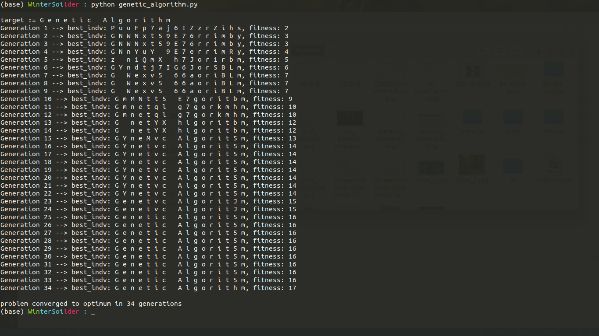

# Genetic-Programming
Basic Genetic Programming in Python

This repository is easy to follow if you know some basics of genetic programming, if not then read [this](https://www.geeksforgeeks.org/genetic-algorithms/) first.

Here is a sample run :-

